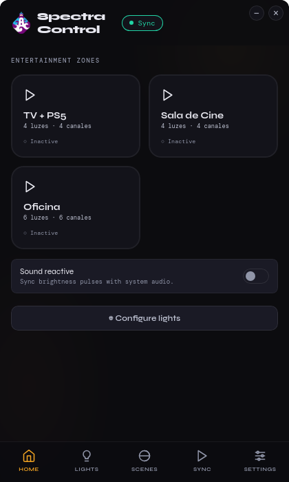
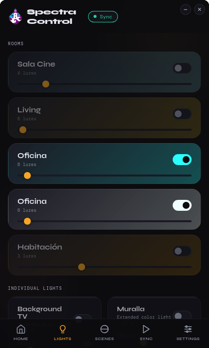
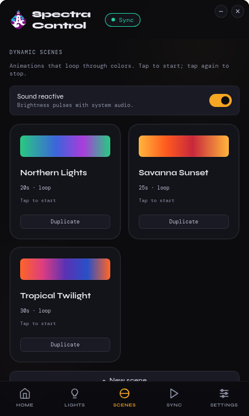

# SpectraControl

[](https://github.com/sebascode/SpectraControl_App/releases)
[](LICENSE)
[](https://github.com/sebascode/SpectraControl_App/actions/workflows/release.yml)

Linux desktop app for Philips Hue lights, with screen-to-light sync over the official Hue Entertainment API v2. Fills the gap left by the Hue Sync app, which has no Linux version.

**→ Landing page with screenshots: [spectracontrol.scode.casa](https://spectracontrol.scode.casa/)**

Tested on Bazzite (Fedora 44 immutable) + GNOME Wayland with NVIDIA. Should also work on KDE Plasma Wayland and any compositor that exposes `xdg-desktop-portal` Screencast.

<p align="center">
  
  
  
</p>

## Features

**Light control**
- Per-light and per-room control (on/off, brightness, color)
- Dynamic scenes — animated color loops with adjustable tempo, loaded from `~/.config/spectracontrol/scenes/*.json` (override built-ins by `id`)
- Light Configurator: drag each light to its place in front of the monitor for accurate Screen Sync

**Screen Sync**
- **Entertainment v2 streaming** — DTLS directly to the bridge on UDP 2100 (HueStream v2). Shows as "synchronized" in the official Hue app.
- **Native Wayland screen capture** — `xdg-desktop-portal` Screencast + GStreamer (`pipewiresrc`) under Tauri. Bypasses WebKitGTK's broken `getDisplayMedia` on Wayland.
- **Browser fallback** — Firefox at `http://localhost:8000` uses `getDisplayMedia()` for environments without Tauri.

**Desktop integration**
- System tray icon (show/quit), with "minimize to tray" as the default close behavior
- Start with system + optional "auto-start Screen Sync on launch"
- Native system notifications (sync state changes, updates, errors)
- Borderless window with custom titlebar, per-zone brightness slider
- Light/dark theme toggle

**Updates & profile**
- In-app updater backed by GitHub Releases (signed `latest.json` via minisign)
- Manual "Check for updates" button in Settings
- Profile export/import (bridge credentials + preferences as a single JSON)

**Internationalization**
- File-based translations (`frontend/i18n/<locale>.json`), Spanish and English shipped, language picker on first launch and in Settings
- Native widgets (tray menu) re-localized at runtime through a Tauri command

## Requirements

- Linux with Wayland and `xdg-desktop-portal` (KDE or GNOME)
- Philips Hue Bridge v2 paired with `generateclientkey: true`
- Go 1.21+
- Rust + `cargo install tauri-cli` (for the desktop app)
- GStreamer with `pipewiresrc` (`gstreamer1-plugin-pipewire`)
- Build-only (Bazzite/Fedora 44):
  ```bash
  sudo rpm-ostree install pipewire-devel clang-devel glibc-devel \
    wayland-devel libxcb-devel webkit2gtk4.1-devel
  sudo rpm-ostree apply-live --allow-replacement   # or reboot
  ```

## Running

```bash
# Tauri desktop window (recommended)
cargo tauri dev

# Browser mode — Firefox at http://localhost:8000
./run.sh
```

`run.sh` builds and starts the Go backend on `:8000`. `cargo tauri dev` does the same automatically via `beforeDevCommand`.

> Chromium-based browsers and the WebKitGTK webview don't deliver frames from `getDisplayMedia()` on Wayland. Use Tauri (native portal capture) or Firefox (which uses pipewire correctly).

## Installation

Pre-built bundles for each tagged release live in [GitHub Releases](https://github.com/sebascode/SpectraControl_App/releases) (AppImage, .deb, .rpm). Pick whichever matches your distro.

### AppImage (recommended — distro-agnostic, supports auto-update)

```bash
chmod +x SpectraControl_*_amd64.AppImage
./SpectraControl_*_amd64.AppImage
```

> Needs `libfuse2` to mount itself. On modern Fedora that is `fuse-libs`. As a fallback, run with `--appimage-extract-and-run`.

### .deb / .rpm

```bash
sudo dpkg -i SpectraControl_*_amd64.deb        # Debian/Ubuntu
sudo rpm -i SpectraControl-*.x86_64.rpm        # Fedora/RHEL
```

The bundles embed the Go backend (`spectractl`) and the frontend, so no separate install is needed. Config is written to `~/.config/spectracontrol/hue_config.json`. User scenes are picked up from `~/.config/spectracontrol/scenes/*.json` (override built-ins by `id`).

### Building locally

```bash
./build.sh appimage,deb,rpm
# → src-tauri/target/release/bundle/{appimage,deb,rpm}/
```

`build.sh` runs `cargo tauri build` with `NO_STRIP=true`, which is required on Fedora 40+ — Fedora's shared libraries use packed relocations (`.relr.dyn` / `DT_RELR`) that the `strip` bundled in `linuxdeploy` does not recognise.

## In-app updates

Updates are driven by the [`tauri-plugin-updater`](https://v2.tauri.app/plugin/updater/) plugin against a signed `latest.json` published with every release.

On launch the app GETs `https://github.com/sebascode/SpectraControl_App/releases/latest/download/latest.json`. If the published version is newer than the running one, a banner appears at the top of the window with **Actualizar / Update**. Clicking it:

1. Downloads the new `.AppImage`, verifies it against the minisign signature compiled into the binary, and atomically replaces the file on disk.
2. Shows "Update ready — reopen the app" and exits cleanly. Reopen the AppImage and the new version takes over.

A manual **"Chequear actualizaciones"** button is available in Settings → Acerca de, with explicit feedback ("Estás en la última versión", error toasts, etc.).

`.deb` / `.rpm` users don't get in-place install — re-download and run your package manager.

## Releasing

CI builds and publishes on tag push. To cut a release:

```bash
# bump src-tauri/Cargo.toml and tauri.conf.json to the new version first
git commit -am "chore: bump version to 0.2.X"
git tag v0.2.X
git push origin master v0.2.X
```

`.github/workflows/release.yml` then:

1. Builds AppImage + deb + rpm on `ubuntu-22.04`, injecting the version into the Go binary via `-ldflags "-X main.Version=$SPECTRA_VERSION"`.
2. Signs the AppImage with the minisign key whose public half is embedded in the app, producing `latest.json` + `.AppImage.sig`.
3. Uploads the bundles + `SHA256SUMS` + `latest.json` to the GitHub Release for that tag.

You can dry-run the build (no publish) from the **Actions** tab → *Release* → *Run workflow*.

Pre-releases: tag with a suffix like `v0.2.8-beta1` and GitHub marks the release as prerelease. The default updater endpoint (`releases/latest/download/latest.json`) only resolves to the most recent stable, so users on stable will not see beta releases.

## First-time setup

1. Launch the app. Pick your language (Español / English) — this is the only one-time decision.
2. Settings → enter your bridge IP, or click **Descubrir** to auto-detect.
3. Press the physical button on the bridge, then click **Vincular**. The bridge returns an API key + a 32-byte `client_key` (PSK for DTLS).
4. Lights and rooms load automatically. Config is persisted to `~/.config/spectracontrol/hue_config.json`.

If the `client_key` is missing (older pairings without `generateclientkey`), re-pair from the setup screen — Entertainment streaming requires it.

## Screen Sync

1. Open the **Inicio** tab. Each entertainment area defined in the Hue app appears as a card.
2. Click a card. Approve the screen-capture portal prompt the first time (Tauri mode) — after that, no prompt.
3. The card turns green and shows "Sincronizando". Lights mirror the colors of your screen.
4. Click again to stop.

For a set-and-forget setup, enable **Iniciar con el sistema** + **Iniciar Screen Sync al arrancar** in Settings → Apariencia. The app launches at login, picks up the last used entertainment area, and starts syncing without a single click.

The capture pipeline downscales the screen to 320×180 RGB in GStreamer, so sampling stays cheap regardless of display resolution. The bridge receives ~30 fps of color updates per channel via DTLS.

## Stack

| Layer | Tech |
|---|---|
| Backend | Go · chi · gorilla/websocket · pion/dtls |
| Frontend | Vanilla HTML/CSS/JS (single file, no bundler) |
| Desktop shell | Tauri 2 (Rust) |
| Screen capture (Tauri) | `ashpd` (xdg-desktop-portal Screencast) + `gst-launch-1.0` (`pipewiresrc → videoscale → fdsink`) |
| Screen capture (browser) | `getDisplayMedia()` |
| Hue API v1 | Local REST (lights, groups, config) |
| Hue API v2 (CLIP) | HTTPS (entertainment configs, application id) |
| Entertainment streaming | UDP/DTLS · HueStream v2 · bridge port 2100 |
| Updates | `tauri-plugin-updater` + signed `latest.json` (minisign) |
| i18n | File-based JSON dictionaries loaded at runtime |

## Project structure

```
SpectraControl/
├── backend/
│   ├── main.go            ← HTTP routes, WebSocket, color conversion
│   ├── entertainment.go   ← DTLS streaming, CLIP v2, HueStream packet builder
│   ├── scenes.go          ← dynamic scene runner (JSON-loaded presets)
│   ├── scenes/*.json      ← built-in scene presets (embedded via go:embed)
│   ├── brightness.go      ← global brightness state, applied to sync + scenes
│   └── go.mod / go.sum
├── frontend/
│   ├── index.html         ← entire UI
│   └── i18n/*.json        ← translations (one file per locale)
├── src-tauri/
│   ├── src/main.rs        ← spawns Go backend, runs ashpd + gst capture, tray, autostart
│   ├── capabilities/      ← Tauri permission grants per plugin
│   ├── Cargo.toml
│   └── tauri.conf.json
├── docs/                  ← Hue API v2 reference (offline copy)
├── run.sh                 ← build + run the Go backend standalone
└── build.sh               ← build the AppImage (release)
```

## Roadmap

The active backlog lives in [GitHub Project #4 — SpectraControl Roadmap](https://github.com/users/sebascode/projects/4). Highlights coming next:

- Audio sync (system / music) — [#5](https://github.com/sebascode/SpectraControl_App/issues/5)
- In-app dynamic scene editor — [#8](https://github.com/sebascode/SpectraControl_App/issues/8)
- Real-time state sync from the bridge — [#15](https://github.com/sebascode/SpectraControl_App/issues/15)
- Configurable log verbosity — [#16](https://github.com/sebascode/SpectraControl_App/issues/16)
- Bootstrap unit tests for backend + Rust shell — [#17](https://github.com/sebascode/SpectraControl_App/issues/17)

## Troubleshooting

- **"DTLS conectado" but lights stay at neutral white** — the keepalive frame is rendering. The screen capture isn't producing frames. In Tauri mode, check the `cargo tauri dev` terminal for `[capture]` logs. In browser mode, only Firefox works on Wayland.
- **App says "sincronizado" but lights don't change color** — make sure all lights in the entertainment area are reachable in the Hue app. The streaming protocol does not turn lights on; SpectraControl turns them on before activating the stream, but powered-off bulbs (zigbee unreachable) won't respond.
- **`client_key` missing** — re-pair from the setup screen. Required for Entertainment v2 (DTLS PSK).
- **Build errors on Bazzite** referring to `libgbm` or `mesa-libgbm-devel` — these come from `xcap` / `libwayshot-xcap`. SpectraControl doesn't use them; if a `cargo build` complains, re-check `Cargo.toml` deps match the current tree.
- **Update banner says "address already in use" after install** — fixed in 0.2.8. Older versions could leave the previous backend running after an in-place update; just kill leftover `spectractl` and `spectra-control` processes and relaunch.

## Known limitations

- Audio sync (#5) and per-light rectangular sections (#3) are not yet implemented.
- The AppImage build needs `NO_STRIP=true` on Fedora 40+ (handled automatically by `build.sh`); other distros may not need it.

## Contributing

See [CONTRIBUTING.md](CONTRIBUTING.md) for dev setup, repo layout, commit conventions, and the release flow. Issues and PRs welcome.

## License

MIT — see [LICENSE](LICENSE).
