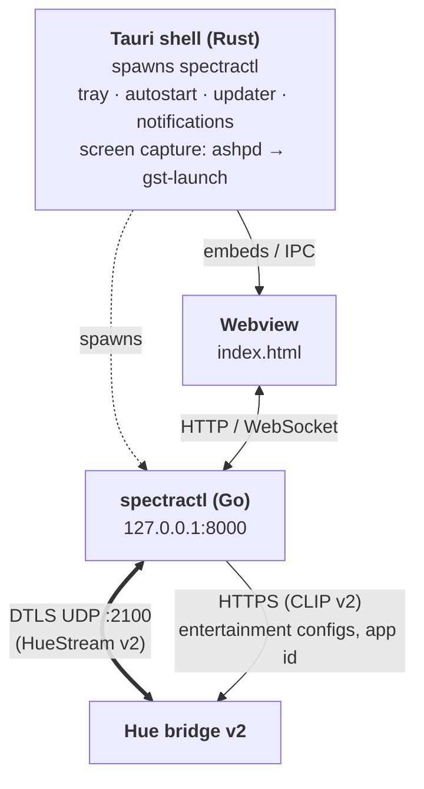
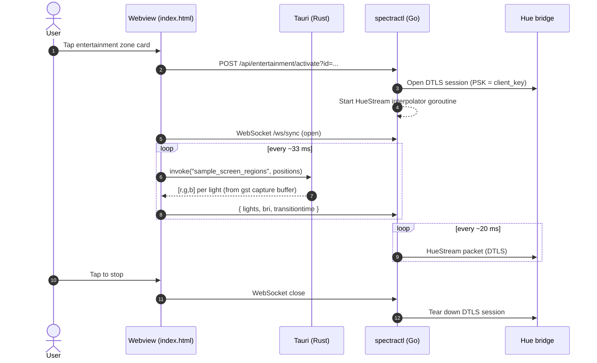
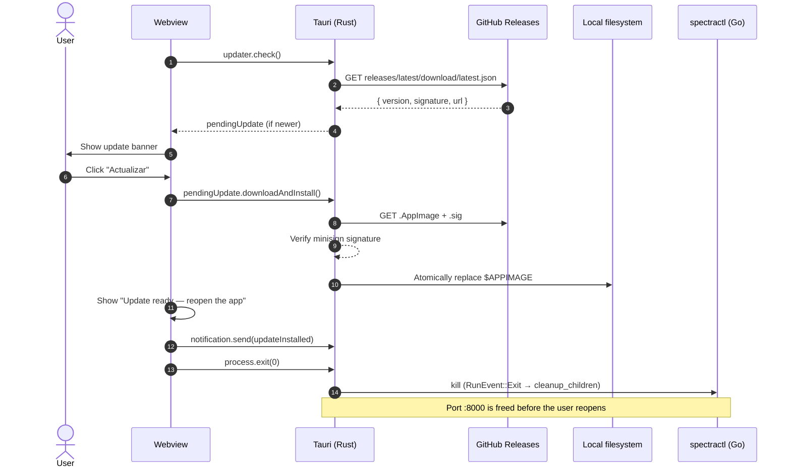

# Architecture overview

SpectraControl is three processes that cooperate:

## Process roles

### `spectractl` — Go backend (`backend/`)
- HTTP server on `127.0.0.1:8000` (chi router).
- REST endpoints for lights, groups, scenes, profile, entertainment configs.
- WebSocket endpoint that the frontend uses to push per-frame color updates during Screen Sync.
- DTLS streamer (`pion/dtls`) that talks the HueStream v2 protocol on UDP 2100. Interpolates incoming color updates and sends ~30 fps to the bridge.
- Loads built-in scene presets via `go:embed`, and merges user scenes from `~/.config/spectracontrol/scenes/`.
- Persists bridge credentials to `~/.config/spectracontrol/hue_config.json`.

### Webview — frontend (`frontend/index.html` + `i18n/`)
- Single HTML file, no bundler, no framework. Strings flow through a runtime i18n dict loaded from `frontend/i18n/<locale>.json`.
- Talks to `spectractl` over HTTP for reads/writes, WebSocket for the sync loop.
- In Tauri mode, calls `core.invoke('sample_screen_regions', ...)` once per sync tick to get sampled pixels from the screen capture pipeline. In browser mode, captures via `getDisplayMedia()` and samples in-page on a hidden `<canvas>`.
- Preferences (theme, locale, sync target zone, autostart-sync flag) live in `localStorage`.

### Tauri shell (`src-tauri/src/main.rs`)
- In release builds, spawns `spectractl` as a child process from the bundled `backend/` resource and kills it on `RunEvent::Exit`.
- Owns the screen capture pipeline (Linux):
  1. Negotiates a Screencast session with `xdg-desktop-portal` through `ashpd`.
  2. Spawns `gst-launch-1.0` with `pipewiresrc → videoscale → fdsink fd=1`, reads raw RGB frames from stdout into a `Mutex`'d buffer.
  3. Exposes `sample_screen_regions(positions)` so the frontend can pull averaged colors for each light without doing IPC per region.
- Hosts the system tray (`tray-icon` feature), autostart plugin, notification plugin, updater plugin, and process plugin.
- Window close behavior is governed by two `AtomicBool` states: `IsQuitting` and `QuitOnClose`. Default (`quit_on_close=false`) hides to tray on X.

## Boundaries

| Concern                      | Lives in           |
|------------------------------|--------------------|
| Hue protocol (REST + DTLS)   | `backend/`         |
| Frontend UI + state          | `frontend/`        |
| Screen capture (Wayland)     | `src-tauri/`       |
| Tray, autostart, updates     | `src-tauri/`       |
| Translations                 | `frontend/i18n/`   |
| Native widget strings        | `src-tauri/` + `frontend/index.html` (via `syncNativeStrings()`) |
| Bridge credentials persistence | `backend/` writes `~/.config/spectracontrol/hue_config.json` |
| User preferences persistence | `frontend/` via `localStorage` |

The webview never speaks DTLS directly — it always goes through the Go backend over WebSocket. The Tauri shell never touches the bridge — it only hosts the webview and provides Wayland-only capabilities (capture, tray, autostart) that the webview can't do on its own.

## Data flow during Screen Sync (Tauri mode)

## Update flow

The old `process.relaunch()` path is intentionally avoided: it raced the new instance against the old one for `:8000`. See [#25](https://github.com/sebascode/SpectraControl_App/issues/25).
